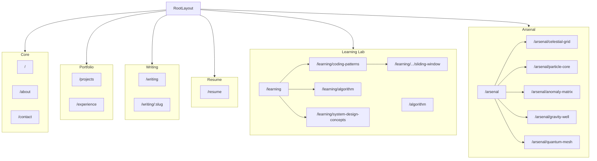
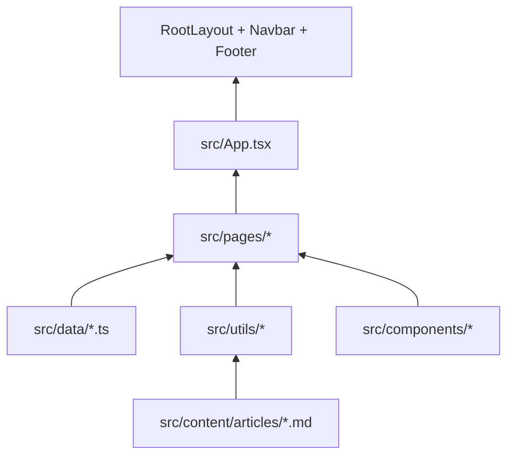

# Repository knowledge graph

Structured map of routes, pages, data, shared components, and tooling for AI agents and contributors.

**Also see:** [`.arsenal/knowledge-graph.json`](../.arsenal/knowledge-graph.json) — auto-generated full repo graph from the Arsenal context engine (410+ nodes). Use `.cursor/knowledge-graph/` for curated task routing; use `.arsenal/` for deep exploration and summaries.

| File                                               | Purpose                                    |
| -------------------------------------------------- | ------------------------------------------ |
| [`graph.json`](./graph.json)                       | Canonical nodes + edges (edit this)        |
| [`SCHEMA.md`](./SCHEMA.md)                         | Node/edge types and ID rules               |
| [`AGENT_INSTRUCTIONS.md`](./AGENT_INSTRUCTIONS.md) | How agents should use and update the graph |

```bash
npm run verify:kg        # validate graph vs filesystem + App.tsx routes
npm run verify:arsenal   # validate .arsenal/ context workspace
```

## Domain map



## Layer stack



## Quick pointers

- **Edit copy** → start at `data:*` nodes in `graph.json`
- **New page** → `App.tsx` + `graph.json` route node + optional `data:navigation`
- **Hub cards** → `component:interactive-card` (quad density, 4-col grid)
- **Quality gates** → `AGENTS.md`, `script:validate`
